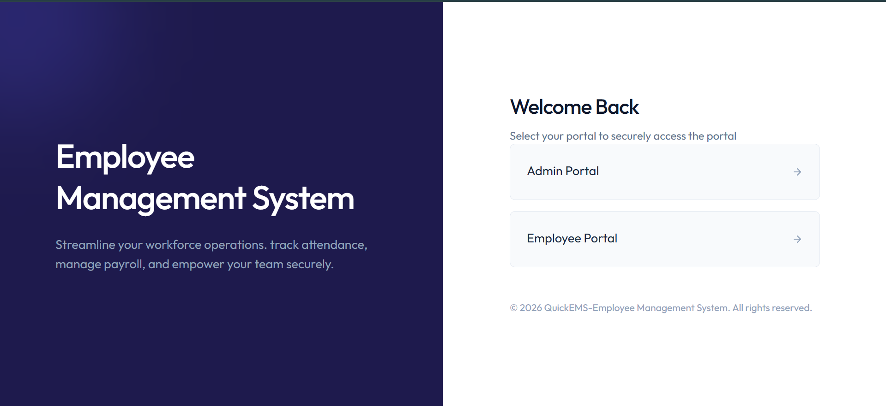
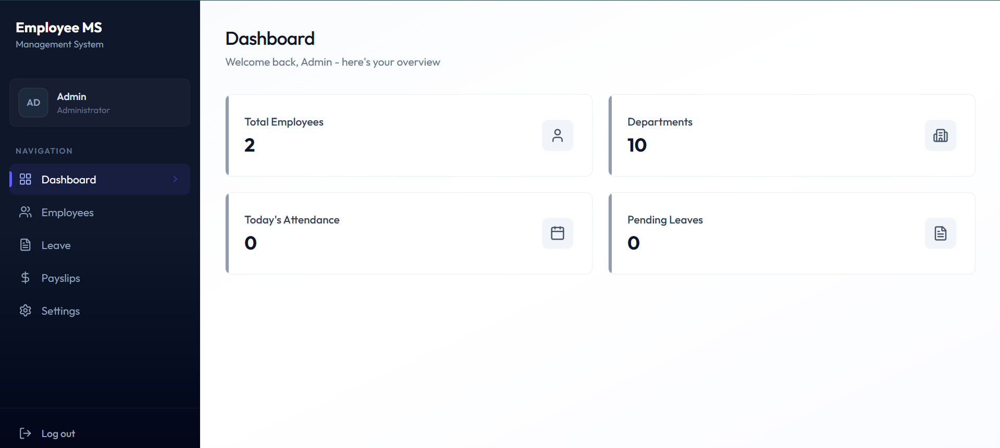
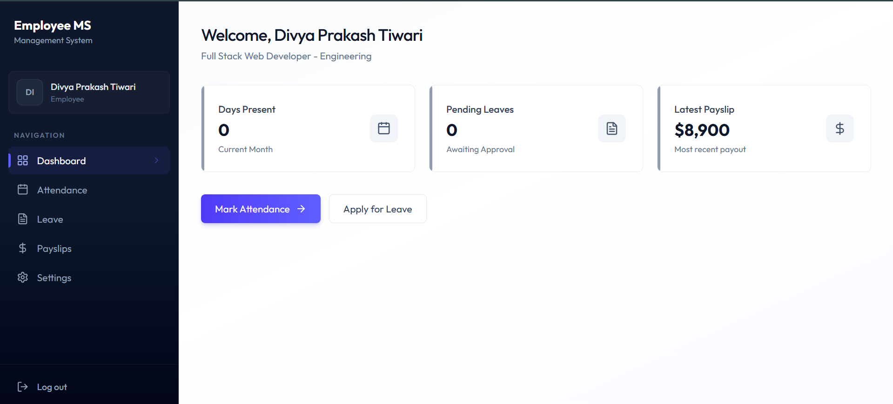
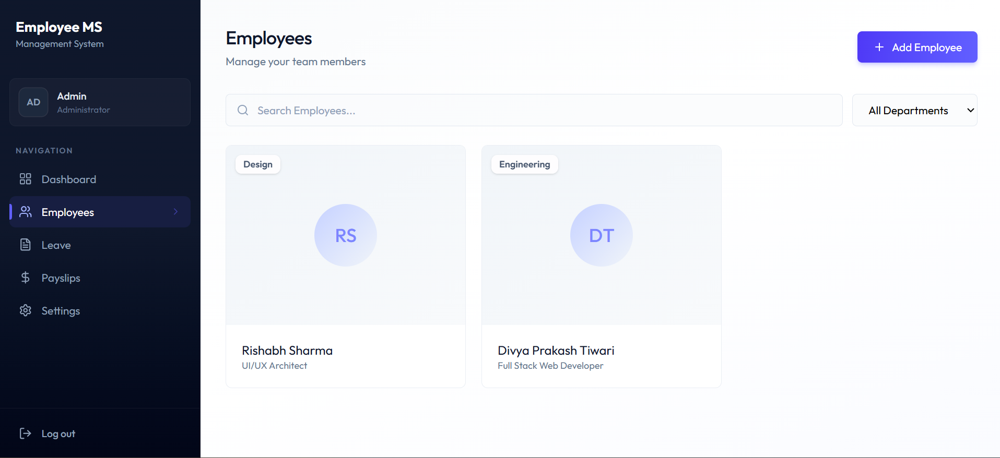
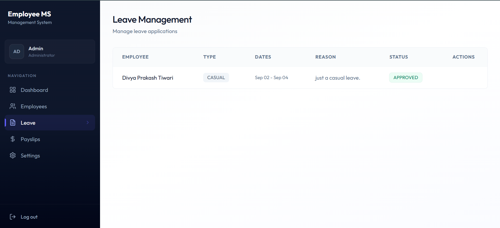
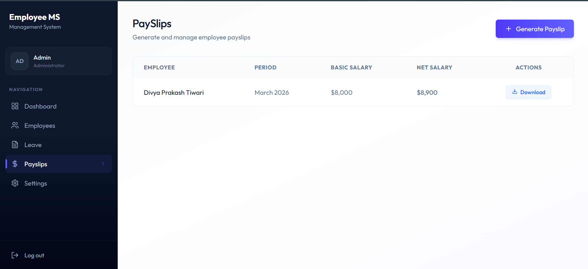

<div align="center">

# QuickEMS 👨‍💼 Employee Management System

A full-stack MERN application for managing employees, attendance, leave, and payslips — with role-based Admin and Employee portals.

[](https://react.dev)
[](https://nodejs.org)
[](https://www.mongodb.com)
[](https://tailwindcss.com)
[](https://jwt.io)
[](https://www.inngest.com)
[](https://vercel.com)
[](LICENSE)

**[Live Demo](https://employee-management-system-eta-steel.vercel.app)** · **[Backend API](https://employee-management-system-server-theta.vercel.app)** · **[Report a Bug](../../issues)**

</div>

> If you find this project useful, consider giving it a ⭐️

---

## 📖 Introduction

Managing a team by hand — spreadsheets for attendance, email threads for leave requests, manual payslip math — doesn't scale past a handful of people. **QuickEMS** solves this with a single web app where admins manage the whole organization and employees self-serve their own attendance, leave, and payslip history, all gated behind role-based authentication.

This repo covers the complete implementation: authentication, employee CRUD with soft-delete, attendance clock-in/out with automatic day-type calculation, leave approval workflows, payslip generation, and automated background reminders via Inngest.

---

## 🎬 Demo

### Video Walkthroughs

- 🎥 [Admin Portal Demo](./screenshots/QuickEMS%20-%20ADMIN.mp4)
- 🎥 [Employee Portal Demo](./screenshots/QuickEMS%20-%20EMPLOYEE.mp4)

### Screenshots

| Login Portal | Admin Dashboard | Employee Dashboard |
|:---:|:---:|:---:|
|  |  |  |

| Employees List | Leave | Payslips |
|:---:|:---:|:---:|
|  |  |  |

---

## ⚙️ Modules & Features

| Module | Stack | Description |
|---|---|---|
| **Authentication** | JWT, bcrypt | Login for Admin/Employee roles, hashed passwords, protected routes via middleware |
| **Employee Management** | Express, Mongoose | Full CRUD, soft-delete + restore, linked User accounts |
| **Attendance** | Mongoose, date-fns | Clock in/out, auto working-hours + day-type calculation (Full/Three-Quarter/Half/Short Day) |
| **Leave Management** | Express, Mongoose | Apply, approve, reject — admin and employee views |
| **Payslips** | Mongoose | Monthly payslip generation with basic salary, allowances, deductions, net salary |
| **Dashboard** | Role-based stats | Org-wide stats for admins, personal stats for employees |
| **Background Jobs** | Inngest | Auto-checkout reminders, leave-approval nudges, daily attendance cron |
| **Email Notifications** | Nodemailer | Automated reminder emails tied to the jobs above |
| **Profile & Settings** | React, Axios | Bio editing, password change |

---

## 🛠️ Tech Stack

| Layer | Technology |
|---|---|
| Frontend | React (Vite), React Router DOM, Tailwind CSS, lucide-react, react-hot-toast |
| Backend | Node.js, Express |
| Database | MongoDB, Mongoose |
| Auth | JWT (jsonwebtoken), bcrypt |
| HTTP Client | Axios |
| Background Jobs | Inngest |
| Email | Nodemailer |
| Deployment | Vercel (frontend + backend), MongoDB Atlas |

---

## 🏗️ Architecture

Client (React + Vite)
│
▼
Axios
│
▼
Express API ──► Middleware (protect / protectAdmin)
│
▼
Controllers
│
▼
Mongoose Models
│
▼
MongoDB Atlas

Inngest ──► Background Jobs ──► Nodemailer ──► Email


---

## 📁 Project Structure

Employee_Management_System/
├── client/ # React frontend
│ └── src/
│ ├── api/ # Axios instance
│ ├── components/ # Reusable UI components
│ ├── context/ # AuthContext
│ └── pages/ # Route-level pages
│
├── server/ # Express backend
│ ├── config/ # DB + Nodemailer config
│ ├── controllers/ # Route logic
│ ├── inngest/ # Background job definitions
│ ├── middleware/ # Auth middleware
│ ├── models/ # Mongoose schemas
│ ├── routes/ # Express routers
│ └── server.js # App entry point
│
└── README.md


---

## 🚀 Getting Started

Clone this repository:

```bash
git clone https://github.com/DIVGIT01/Employee_Management_System.git
```

Navigate into the project directory:

```bash
cd Employee_Management_System
```

**Backend:**

```bash
cd server
npm install
npm run server
```

**Frontend:**

```bash
cd ../client
npm install
npm run dev
```

The frontend runs on `http://localhost:5173`, the backend on `http://localhost:4000`.

---

## 🔑 Environment Variables

Create a `.env` file inside `server/`:

| Variable | Purpose |
|---|---|
| `MONGO_URI` | MongoDB Atlas connection string |
| `JWT_SECRET` | Secret used to sign JWTs |
| `ADMIN_EMAIL` | Email used when seeding the first admin account |
| `PORT` | Express server port (defaults to 4000) |

---

## 👤 User Roles

| Feature | Admin | Employee |
|---|:---:|:---:|
| Org-wide dashboard stats | ✅ | ❌ |
| Create / edit / delete employees | ✅ | ❌ |
| Clock in / out | ❌ | ✅ |
| Apply for leave | ❌ | ✅ |
| Approve / reject leave | ✅ | ❌ |
| Generate payslips | ✅ | ❌ |
| View own payslips | ✅ | ✅ |
| Update own profile | ✅ | ✅ |

---

## 🌱 Future Improvements

- Refresh token rotation
- Rate limiting on auth endpoints
- Pagination & advanced search on employee lists
- File uploads for profile photos
- Automated tests (Jest, React Testing Library)
- CI/CD pipeline

---

## 🤝 Contributing

Suggestions and improvements are welcome — open an issue or submit a PR.

---

## 📝 License

This project is licensed under the [MIT License](LICENSE).

---

## 🧑‍💻 Author

**Divya Prakash Tiwari** — [GitHub](https://github.com/DIVGIT01)
